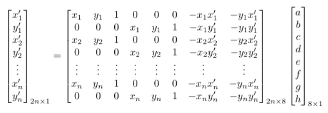
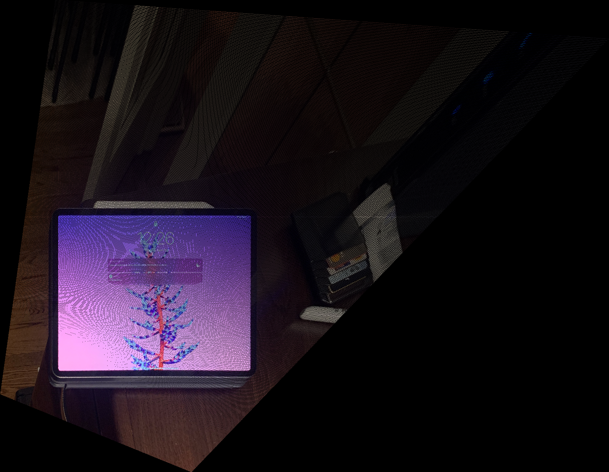
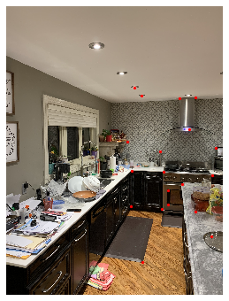
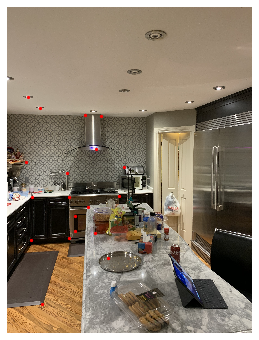
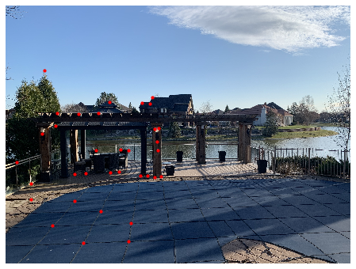
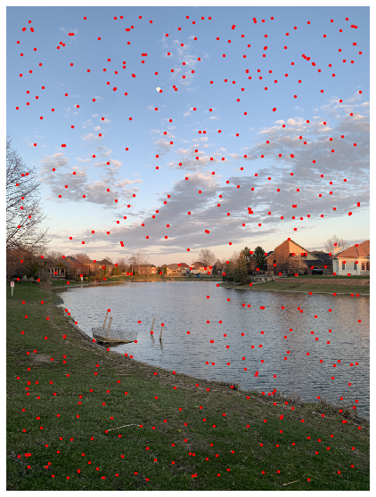
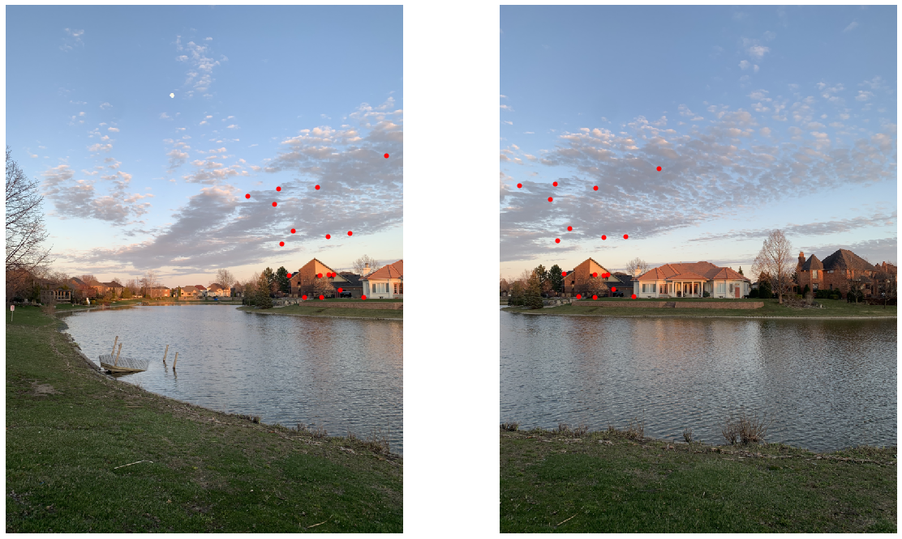
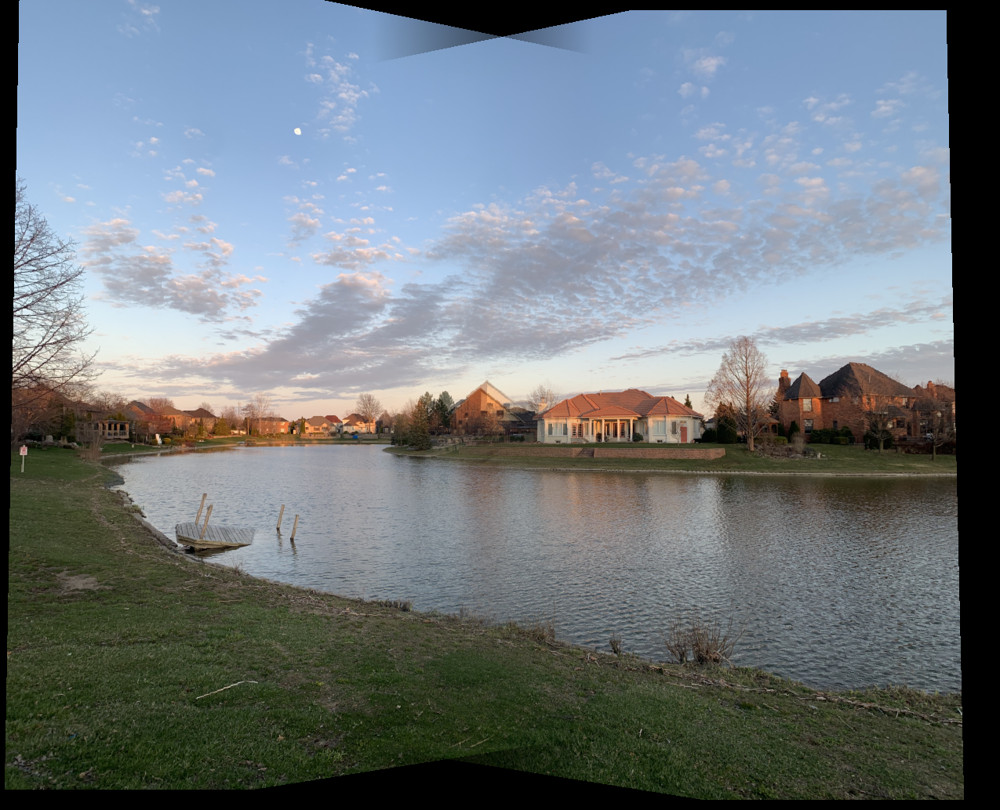
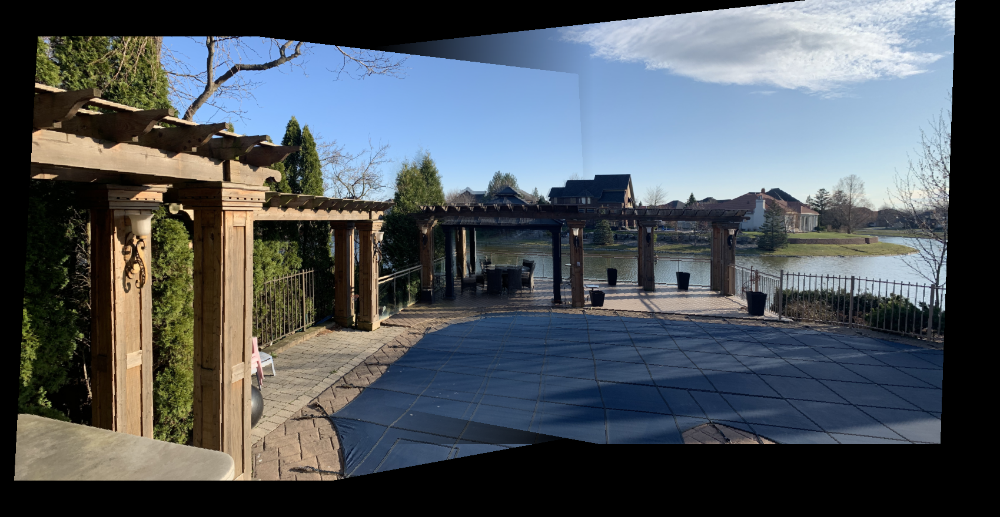
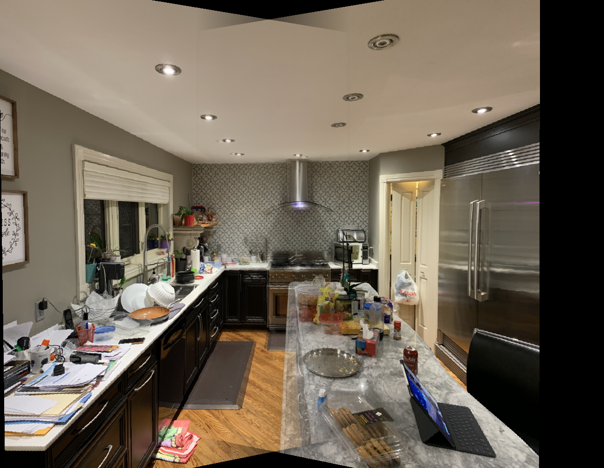

 

<title>[Auto]Stitching Photo Mosaics</title>

<head>
  <meta charset="utf-8">
  <meta http-equiv="X-UA-Compatible" content="IE=edge">
  <!-- common.css -->
  
  <!-- ace-static.css -->
  
  
  <!-- export.css -->
  
  <!-- User CSS -->
  
  
  

</head>

# [Auto]Stitching Photo Mosaics

## Project 5, CS 194-26, Spring 2020

**by Suraj Rampure (`suraj.rampure@berkeley.edu`, `cs194-26-adz`)**

---

In the first half of this project, we create homographies between images, in order to warp one to be in the perspective of another. After doing this, we are able to stitch these images together using a mask, creating a panorama-type effect. In the second half, we automate the process of picking correpondences between the images.

---

## Part A: Image Warping and Mosaicing

### `homography(pts1, pts2)`, `warp_image(im, H)`

The first step is to create a homography between points in one image and points in another. Specifically, we want to find some 3 x 3 matrix $H$ such that maps $p = [x, y, 1]^T$ in image 1 to $p' = w \cdot [x', y', 1]$ in image 2. 

We want to minimize the loss created by our homography. Specifically, we want to minimize 

An equivalent formulation, using the same constants in H, can be written as follows:

The above equation is of the form Av = b; solving for v using least squares gives us estimates of the values of a, b, c, d, e, f, g, h.

Now that we have the values of these 8 constants (and hence, know the 3 x 3 matrix H), we can warp points in one image to those in another using the specified homography. 

 

### Rectification

In order to check that my homography and warping methods were working, I rectified an image. Specifically, I took an image of a painting that was taken from an angled perspective, defined its corners, and computed a homography between the set of corners of that image and a flat rectangle. Below is the original image followed by a rectified version of it.

&nbsp;&nbsp;&nbsp;&nbsp;

As you can see, it turns out quite well. (I took this picture at the Louvre in Paris.)

Here's another example:

&nbsp;&nbsp;&nbsp;&nbsp;

There's some noticable aliasing here, admittedly, but the rectification itself works. I fixed the aliasing later on.

 

### Defining Correspondences

The first step is to take images and define correspondences between them. I took 3 pairs of images, and defined between 19 and 30 correspondences on each. (The first pair is from my kitchen, the second pair is from a park near my house, and the third pair is in my backyard.)

&nbsp;&nbsp;&nbsp;&nbsp; &nbsp;&nbsp;&nbsp;&nbsp;&nbsp;&nbsp;&nbsp;&nbsp;&nbsp;&nbsp;&nbsp;&nbsp;&nbsp;&nbsp;&nbsp;&nbsp;&nbsp;&nbsp;&nbsp;&nbsp;&nbsp;&nbsp;&nbsp;&nbsp; &nbsp;&nbsp;&nbsp;&nbsp;

&nbsp;&nbsp;&nbsp;&nbsp;

 

Then, I computed a median correspondence, similar to what was done in Project 3. (I found that this gave better results than trying to warp image 1 into the perspective of image 2.) This produces warped versions of both images in the pair.

&nbsp;&nbsp;&nbsp;&nbsp; &nbsp;&nbsp;&nbsp;&nbsp;&nbsp;&nbsp;&nbsp;&nbsp;&nbsp;&nbsp;&nbsp;&nbsp;&nbsp;&nbsp;&nbsp;&nbsp;&nbsp;&nbsp;&nbsp;&nbsp;&nbsp;&nbsp;&nbsp;&nbsp; &nbsp;&nbsp;&nbsp;&nbsp;

&nbsp;&nbsp;&nbsp;&nbsp;

 

Lastly, I overlaid and aligned the warped images on top of one another.

 &nbsp;&nbsp;&nbsp;&nbsp;&nbsp;&nbsp;&nbsp;&nbsp;&nbsp;&nbsp;&nbsp;&nbsp;&nbsp;&nbsp;&nbsp; 

 

The park panorama seems to have come out the best; I believe it's because it has the least details in the region of overlap. The kitchen isn't great, especially near on the left edge of the island. The backyard is decent but some details towards the back are imperfect (in particular, the rear pillars).

  

---

## Part 2: Feature Matching for Autostitching

I primarily used the park images while implementing each of the features here, but at the end I present the results of autostitching on the other two examples as well. In order to do the computations in this section, I rescaled my images from being 12MP to 0.75MP (still ~1000 x 700, which is certainly good enough).

 

### Step 0: Harris corners

Luckily, we were provided `get_harris_corners`. Here's the result after calling it on the left park image:

 

### Step 1: Adaptive Non-Maximal Suppression

I then implemented Adaptive Non-Maximal Suppression (ANMS), which is detailed in [this paper](https://inst.eecs.berkeley.edu/~cs194-26/sp20/Papers/MOPS.pdf). In short, this aims to find points that are spaced out that are in relevant positions. I chose the top 500.

 

### Step 2 and 3: Feature Extraction and Feature Matching

In Step 2, we take 8x8 samples (from a larger 40x40 patch) in the neighborhood of each keypoint (in both images), and normalize them. In Step 3, we compare the set of normalized samples in one image with the set of normalized samples in the other, and compute distances between them. The goal of this is to find "matches" between a keypoint in the first image and a keypoint in the second, to denote that these are one correspondence.

In order to select correspondences, I computed the Lowe ratio – (distance to 1NN)/(distance to 2NN) – and took pairs for whom this ratio was below 0.45.

As depicted above, the chosen points are quite close.

 

### Step 4: RANSAC

I then implemented RANSAC, i.e. "Random Sample Consensus", in order to determine the subset of keypoints that created the best homographies. I used this subset of keypoints to generate two homographies again – one from the left image to a median, and one from the right image to a median. I then followed the same process above to warp the two images and stitch them together. 

Below, on the left we have the resulting panorama given by using Part B methods (ANMS, RANSAC), and on the right we have the resulting panorama using manually-defined correspondences from Part A.

&nbsp;&nbsp;&nbsp;&nbsp;&nbsp;&nbsp;&nbsp;&nbsp;
&nbsp;&nbsp;&nbsp;&nbsp;&nbsp;&nbsp;&nbsp;&nbsp;
&nbsp;&nbsp;&nbsp;&nbsp;&nbsp;&nbsp;&nbsp;&nbsp;

 

### Conclusion

This project showed me the many intricacies involved in creating automatic panoramas. It's far more complicated than I thought.