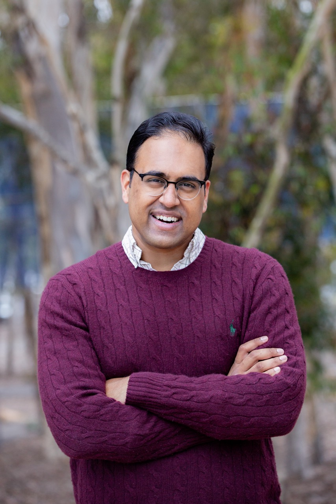

 

# Suraj Rampure
"soo-rudge rahm-poo-ray"

Lecturer III Computer Science and Engineering, University of Michigan 4721 Beyster Building <code>rampure@umich.edu</code> 

<!-- 

  📍
  Loading location...

 -->

> Hey! 👋 I'm a member of the teaching faculty in [Computer Science and Engineering](https://cse.engin.umich.edu/) at the University of Michigan. I am affiliated with [MIDAS](https://midas.umich.edu/faculty-member/suraj-rampure/), serve on the undergraduate computer science and data science program committees, and am one of the hosts of [Faculty Chats](https://cse.engin.umich.edu/academics/undergraduate/undergraduate-advising/faculty-chats/) (come say hi!).
>
> Previously, I taught in the [Halıcıoğlu Data Science Institute](https://datascience.ucsd.edu/) at the University of California, San Diego, where I received the campus-wide Distinguished Teaching Award in 2024. I earned BS and MS degrees in [Electrical Engineering and Computer Sciences](https://eecs.berkeley.edu/) from the University of California, Berkeley, and I'm originally from Windsor, Ontario 🇨🇦.

  

  On this page:
  <a href="#teaching" class="large-button">👨‍🏫 Teaching</a>
  <a href="#scholarship" class="large-button">📚 Scholarship</a>
  <a href="#awards" class="large-button">🏆 Awards and Distinctions</a> 
  Other links:
  <a href="resources/cv-2025.pdf" class="large-button" style="margin-top: 0.5em;">📄 CV</a>
  <a href="tf-app-materials" class="large-button" style="margin-top: 0.5em;">📝 Teaching Faculty Application Materials</a>
  <a href="letters" class="large-button" style="margin-top: 0.5em;">✉️ Recommendation Letters</a>
  <!-- <a href="python-teaching-commons" class="large-button">🐍 Python Teaching Commons</a> -->

## Teaching

Course websites for all courses I've taught as an instructor or TA can be found below. Most websites have links to lecture slides, recordings, and assignments.

<!--   -->

  <!-- Left: Courses (both UMich and UCSD, stacked vertically) -->
  

    <!-- University of Michigan Section -->
    

      <!-- University of Michigan Logo removed -->
      

        <h3 style="display: inline;"></h3>
        
        <block>
          EECS 245: <b>Mathematics for Machine Learning</b>
          <a href="https://eecs245.org" class="small-button" style="font-weight: bold; border-color: #73726c;">Winter 2026</a>
          <a href="https://eecs245.org" class="small-button">Fall 2025</a>
          <!-- &nbsp;&nbsp;&nbsp;&nbsp;&nbsp;&nbsp;&nbsp;&nbsp;
          See also:
          <a href="https://notes.eecs245.org" class="small-button">Course Notes (notes.eecs245.org)</a>
          <a href="https://youtu.be/cPKpJ9ycM-Y?si=PlaLhwoRk0gQMYD1" class="small-button">Testimonials</a> -->
        </block>
        <block>
          EECS 398: <b>Practical Data Science</b>
          <a href="https://practicaldsc.org/" class="small-button">Spring 2025 (Half-Term)</a>
          <a href="https://practicaldsc.org/wn25" class="small-button">Winter 2025</a>
          <a href="https://practicaldsc.org/fa24" class="small-button">Fall 2024</a>
        </block>
        <block>
          <b>Building Robust ML Models (MIDAS Biomedical Researchers Summer Academy)</b>
          <a href="dair3" class="small-button">Summer 2025</a>
        </block>
      

    

      
    <!-- UC San Diego Section -->
    

      

        <h3 style="display: inline;"></h3>
        

        <block>
          DSC 40A: <b>Theoretical Foundations of Data Science I</b>
          <a href="https://dsc-courses.github.io/dsc40a-2024-sp/" class="small-button">Spring 2024</a>
          <a href="https://dsc-courses.github.io/dsc40a-2021-fa/" class="small-button">Fall 2021</a>
        </block>

        <block>
          DSC 95: <b>Tutor Apprenticeship in Data Science</b>
          <a href="https://dsc-courses.github.io/dsc95-2024-sp/" class="small-button">Spring 2024</a>
          <a href="https://dsc-courses.github.io/dsc95-2023-sp/" class="small-button">Spring 2023</a>
        </block>

        <block>
          DSC 80: <b>Practice and Application of Data Science</b>
          <a href="https://dsc-courses.github.io/dsc80-2024-wi" class="small-button">Winter 2024</a>
          <a href="https://dsc-courses.github.io/dsc80-2023-wi" class="small-button">Winter 2023</a>
          <a href="https://dsc-courses.github.io/dsc80-2022-sp" class="small-button">Spring 2022</a>
        </block>

        <block>
          DSC 180AB: <b>Data Science Project (Senior Capstone Coordinator)</b>
          <a href="https://dsc-capstone.org" class="small-button">AY 2023-24</a>
          <a href="https://dsc-capstone.org/2022-23/" class="small-button">AY 2022-23</a>
        </block>

        <block>
          DSC 10: <b>Principles of Data Science</b>
          <a href="https://dsc-courses.github.io/dsc10-2023-fa/" class="small-button">Fall 2023</a>
          <a href="https://dsc-courses.github.io/dsc10-2023-sp/" class="small-button">Spring 2023</a>
          <a href="http://dsc-courses.github.io/dsc10-2022-fa/" class="small-button">Fall 2022</a>
          <a href="http://dsc-courses.github.io/dsc10-2022-wi/" class="small-button">Winter 2022</a>
          <a href="http://dsc-courses.github.io/dsc10-2021-fa/" class="small-button">Fall 2021</a>
        </block>

        <block>
          CSS 201S: <b>Introduction to Python Bootcamp (Week 1 only)</b>
          <a href="https://rampure.org/css-python-bootcamp/" class="small-button">Summer 2022</a>
        </block>

        <block>
          DSC 90: <b>History of Data Science Seminar</b>
          <a href="http://dsc-courses.github.io/dsc90-2022-sp/" class="small-button">Spring 2022</a>
          <a href="http://dsc-courses.github.io/dsc90-2022-wi/" class="small-button">Winter 2022</a>
        </block>
      

    

  

  <!-- Right: About and Interactive Demo -->
  

    

      
<small>These days, I spend a lot of time building interactive teaching materials that help students visualize the mathematics of machine learning.</small>

      

        <iframe src="assets/pca_orthogonal_errors.html" width="750" height="500" style="max-width: 100%; border: none; display: block;" title="PCA Orthogonal Errors Interactive">test</iframe>
      

      
<small>
        This widget shows how PCA equivalently minimizes orthogonal projection error and maximizes variance (<b>drag the slider!</b>). See more like this at <a href="https://notes.eecs245.org">notes.eecs245.org</a>.
      </small>

    

  

  <!-- UC Berkeley Logo removed -->
  

    <h3 style="display: inline;"></h3>
    
    <block>
      Data 94: <b>Introduction to Computational Thinking with Data</b> (now known as <a href="http://data6.org">Data 6</a>)
      <a href="https://rampure.org/data-94-sp21" class="small-button">Spring 2021</a>
    </block>
    <block>
      Data 100: <b>Principles and Techniques of Data Science</b>
      <a href="http://ds100.org/su20" class="small-button">Summer 2020</a>
        <a href="http://ds100.org/fa20" class="small-button">TA: Fall 2020</a>
        <a href="http://ds100.org/sp20" class="small-button">TA: Spring 2020</a>
        <a href="http://ds100.org/fa19" class="small-button">TA: Fall 2019</a>
        <a href="http://ds100.org/sp19" class="small-button">TA: Spring 2019</a>
        <a href="http://ds100.org/fa18" class="small-button">TA: Fall 2018</a>
      <!--  -->
    </block>
    <block>
      CS 198-087: <b>Introduction to Mathematical Thinking</b> (DeCal/Student-Run Course)
      <a href="http://imt-decal.org" class="small-button">Spring 2019</a>
      <a href="http://imt-decal.org/fa18" class="small-button">Fall 2018</a>
    </block>
    <block>
      CS 70: <b>Discrete Mathematics and Probability Theory</b>
      <a href="http://su19.eecs70.org" class="small-button">TA: Summer 2019</a>
    </block>
    <block>
      CS 375: <b>Teaching Techniques for Computer Science</b>
      <a href="http://cs375.github.io/su19" class="small-button">TA: Summer 2019</a>
    </block>
    <block>
      CS 61A: <b>Structure and Interpretation of Computer Programs</b>
      <a href="https://inst.eecs.berkeley.edu/~cs61a/sp18/" class="small-button">TA: Spring 2018</a>
    </block>
    <block>
      Data 8: <b>Foundations of Data Science</b>
      <a href="http://data8.org/fa17" class="small-button">TA: Fall 2017</a>
      <a href="http://data8.org/sp17" class="small-button">Tutor: Spring 2017</a>
    </block>
  

 

## Scholarship

### Panels and Related Sessions

<block style="margin-bottom: 1em;">
  <b><a href="https://sigcse2026.sigcse.org/details/sigcse-ts-2026-birds-of-a-feather/8/Teaching-Faculty-Careers-without-a-PhD-A-Mentoring-Community">Teaching Faculty Careers without a PhD: A Mentoring Community</a></b> 
  Adam Blank, Michael Ball, Travis McGaha, <b>Suraj Rampure</b>, Yesenia Velasco and Kendra Walther. Birds of a Feather session at <em>Proceedings of the 57th ACM Technical Symposium on Computer Science Education (SIGCSE 2026).</em>
</block>
<block style="margin-bottom: 1em;">
  <b><a href="https://sigcse2026.sigcse.org/details/sigcse-ts-2026-birds-of-a-feather/5/Cracking-the-Classroom-Coding-Interview-Technical-Interviews-as-an-Assessment-of-Stu">Cracking the Classroom Coding Interview: Technical Interviews as an Assessment of Student Learning</a></b> 
  Suh Young Choi, Arpan Kapoor, Kevin Lin and <b>Suraj Rampure</b>. Birds of a Feather session at <em>Proceedings of the 57th ACM Technical Symposium on Computer Science Education (SIGCSE 2026).</em>
</block>
<block style="margin-bottom: 1em;">
  <b><a href="https://sigcse2025.sigcse.org/details/sigcse-ts-2025-birds-of-a-feather/31/A-New-Class-of-Teaching-Track-Faculty-No-Ph-D-Required">A New Class of Teaching-Track Faculty: No Ph.D. Required</a></b> Michael Ball, <b>Suraj Rampure</b>, and Kevin Lin. 
  Birds of a Feather session at <em>Proceedings of the 56th ACM Technical Symposium on Computer Science Education (SIGCSE 2025).</em>
</block>
<block style="margin-bottom: 1em;">
  <b><a href="https://dl.acm.org/doi/10.1145/3545947.3569608">A New Class of Teaching-Track Faculty: No Ph.D. Required</a></b> 
  Kendra Walther, Adam Blank, Michael Ball, and <b>Suraj Rampure</b>. Panel at <em>Proceedings of the 54th ACM Technical Symposium on Computer Science Education (SIGCSE 2023).</em>
</block>
<block style="margin-bottom: 1em;">
  <b><a href="https://dl.acm.org/doi/10.1145/3478432.3499227">A New Class of Teaching-Track Faculty: No Ph.D. Required</a></b> 
  Kendra Walther, Adam Blank, Michael Ball, and <b>Suraj Rampure</b>. Panel at <em>Proceedings of the 53rd ACM Technical Symposium on Computer Science Education (SIGCSE 2022).</em>
</block>
<block style="margin-bottom: 1em;">
  <b><a href="https://data.berkeley.edu/2022workshop/schedule">Introduction to Computational Thinking with Data and Society</a></b> 
  Deb Nolan, Lisa Yan, <b>Suraj Rampure</b>, and Vivian Carter. In <em>2022 National Workshop on Data Science Education</em>. 
  <a class="small-button" href="https://youtu.be/rCEix9s4CpM?si=vGkiWFt-F2DpAYOI">🎥 video</a>
</block>

### Talks
<block style="margin-bottom: 1em;">
  <b><a href="https://jupytercon2025.sched.com/event/28H4f/rise-and-shine-teaching-with-jupyter-notebooks-in-real-time-suraj-rampure-nishant-kheterpal-university-of-michigan-janine-tiefenbruck-university-of-california-san-diego">RISE and Shine: Teaching with Jupyter Notebooks in Real Time</a></b> 
  <b>Suraj Rampure</b>, Nishant Kheterpal, and Janine Tiefenbruck. Talk at <em>JupyterCon 2025</em>. 
  <a class="small-button" href="https://youtu.be/1zCTI_8bqI8?si=_1_-39rZAe0I_Dqz">🎥 video</a>
</block>
<block style="margin-bottom: 1em;">
  <b><a href="https://www.imsi.institute/videos/different-mediums-for-different-audiences-a-capstone-case-study/">Different Mediums for Different Audiences: A Capstone Case Study</a></b> 
  <b>Suraj Rampure</b>. Invited talk at <em>Teaching and Evaluating Data Communication at Scale 2024</em>. 
  
    <a href="https://cdn.imsi.institute/videos/49129/iPxQvXT38E/slides.pdf" class="small-button">🗣️ slides</a>
    <a href="https://www.imsi.institute/videos/different-mediums-for-different-audiences-a-capstone-case-study/" class="small-button">🎥 video</a>
  
</block>
<block style="margin-bottom: 1em;">
  <b><a href="https://cfp.jupytercon.com/2023/talk/XABS9S/">Otter-Grader: A Lightweight Solution for Creating and Grading Jupyter Notebook Assignments</a></b> 
  <b>Suraj Rampure</b>, Christopher Pyles, Justin Eldridge, and Lisa Yan. Talk at <em>JupyterCon 2023</em>. 
  
    <a href="https://github.com/chrispyles/otter-grader-jupytercon-2023" class="small-button">📂 materials</a>
    <a href="https://www.youtube.com/watch?v=9_x532_2T2w" class="small-button">🎥 video</a>
  
</block>
<block style="margin-bottom: 1em;">
  <b><a href="https://data.berkeley.edu/academics/resources/data-science-education-workshop/2021-national-workshop-data-science-education">Data 6: A New Introductory Course</a></b> 
  <b>Suraj Rampure</b>. Talk at <em>2021 National Workshop on Data Science Education</em>. 
  
    <a href="https://docs.google.com/presentation/d/1eeJvHmDNQanVOFjKn8Jky63ONxHPmDyq6I764f-YPdE/edit#slide=id.gb6d01dc2f6_0_124" class="small-button">🗣️ slides</a>
    <a href="https://www.youtube.com/watch?v=4pMLelvesR8" class="small-button">🎥 video</a>
  
</block>
<block style="margin-bottom: 1em;">
  <b><a href="https://data.berkeley.edu/academics/resources/data-science-education-resources/2020-national-workshop-data-science-education">Various sessions on Data 100: Principles and Techniques of Data Science</a></b> 
  <b>Suraj Rampure</b> et al. Talks at<em>2020 National Workshop on Data Science Education</em>. 
  
    <a href="https://www.youtube.com/watch?v=VxL9L7VkJTE&feature=youtu.be" class="small-button">🎥 pre-recorded talk</a>
    <a href="https://www.youtube.com/watch?v=lfyyZQDlyXQ" class="small-button">🎥 Q&amp;A</a>
    <a href="https://www.youtube.com/watch?v=1FsYgKKh9gk&feature=youtu.be" class="small-button">🎥 workshop</a>
  
</block>

### Papers

<block style="margin-bottom: 1em;">
  <b><a href="https://lau.ucsd.edu/pubs/Challenges-of-Evolving-Data-Courses_L@S-2022.pdf">The Challenges of Evolving Technical Courses at Scale: Four Case Studies of Updating Large Data Science Courses</a></b> 
  Sam Lau, Justin Eldridge, Shannon Ellis, Aaron Fraenkel, Marina Langlois, <b>Suraj Rampure</b>, Janine Tiefenbruck, Philip Guo. In <em>ACM Conference on Learning @ Scale (L@S), 2022</em>.
</block>
<block style="margin-bottom: 1em;">
  <b><a href="https://www2.eecs.berkeley.edu/Pubs/TechRpts/2021/EECS-2021-106.html">A New Data-Focused Introductory Programming Course</a></b> 
  <b>Suraj Rampure</b>. 2021. Master's technical report, UC Berkeley EECS.
</block>
<block style="margin-bottom: 1em;">
  <b><a href="https://dl.acm.org/doi/pdf/10.1145/3408877.3432561">Experiences Teaching a Large Upper-Division Data Science Course Remotely</a></b> 
  <b>Suraj Rampure</b>*, Allen Shen*, and Josh Hug. In <em>Proceedings of the 52nd ACM Technical Symposium on Computer Science Education (SIGCSE 2021).</em>
   
  
    <a href="https://docs.google.com/presentation/d/1xBMcdYKrhM0U1FxOKZ93TCqIdDIWFqdz7ns49LN_ukg/edit?usp=sharing" class="small-button">🗣️ slides</a>
    <a href="https://youtu.be/_p-JUp4QyNA" class="small-button">🎥 video</a>
  
</block>

### Media

<block>
  UC San Diego Today: <b><a href="https://today.ucsd.edu/story/signature-program-demonstrates-how-uc-san-diego-undergraduates-learn-to-transform-data-into-action">Signature Program Demonstrates How UC San Diego Undergraduates Learn to Transform Data into Action</a></b></block>
<block>
  ComputingPaths at UC San Diego: <b><a href="https://www.youtube.com/watch?v=rQYUDs6Wz3E">Meet Suraj Rampure, Lecturer in the Halıcıoğlu Data Science Institute</a></b>
</block>
<block>
  UC Berkeley Research News: <b><a href="https://vcresearch.berkeley.edu/news/uc-berkeley-and-tuskegee-university-announce-data-science-partnership">UC Berkeley and Tuskegee University Announce Data Science Partnership</a></b>
</block>
<block>
  UC Berkeley Data Science Education Podcast: <b><a href="https://datascienceeducation.substack.com/p/the-importance-of-data-science-course">The Importance of Data Science Course Staff</a></b>
</block>

 

<!-- --- -->

## Awards and Distinctions

  

    <h3>Awards</h3>
    <block>2023-2024 <a href="https://senate.ucsd.edu/grants-awards/senate-awards/distinguished-teaching-award/recipient-history">UC San Diego Distinguished Teaching Award</a></block>
    <block>
      2020-2021 <a href="https://rtl.berkeley.edu/extraordinary-teaching-extraordinary-times-award">UC Berkeley Extraordinary Teaching in Extraordinary Times Award</a>
      <a href="https://data.berkeley.edu/news/cdss-instructors-honored-five-awards-extraordinary-teaching-extraordinary-times" class="small-button" style="margin-left: 0.5em;">📰 article</a>
    </block>
    <block>2019-2020 <a href="https://www2.eecs.berkeley.edu/Students/Awards/13/">UC Berkeley EECS Distinguished GSI Award</a></block>
    <block>2017-2018 <a href="https://gsi.berkeley.edu/programs-services/award-programs/ogsi/ogsi-2018/">UC Berkeley EECS Outstanding GSI Award</a></block>
    <!--   -->
    <h3>Distinctions</h3>
    <block>Fall 2024 LEO Lecturers Professional Development Fund Recipient</block>
  

  

    <small>Distinguished Teaching Award ceremony UC San Diego, May 2024</small>
  

