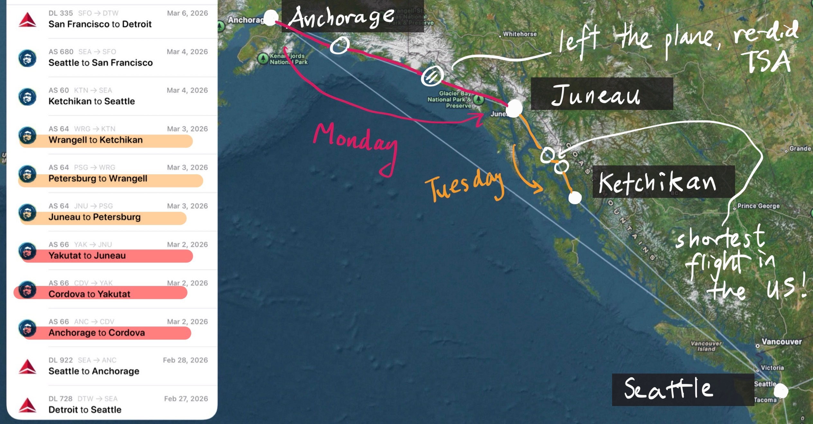

<link
  rel="stylesheet"
  href="https://cdnjs.cloudflare.com/ajax/libs/lightbox2/2.11.5/css/lightbox.min.css"
/>

# {{ page.title }}

by [Suraj Rampure](../)

In the first week of March 2026, I embarked on the Alaska Airlines [Milk Run](https://news.alaskaair.com/alaska-airlines/the-milk-run-flight/). From Alaska's website:

> The Milk Run refers to the daily circuit of Alaska Airlines flights that hop between towns in Southeast Alaska, serving as a lifeline for the communities that aren’t always connected by roads to the outside world.

My buddy Sukrit and I used the Milk Run as an excuse to spend a few days in Alaska over Michigan's spring break. (The screenshot comes from the app [Flighty](https://flighty.com/).)

In total, I spent 4 nights in Alaska (2 in Anchorage, 1 in Juneau, and 1 in Ketchikan), with a night in Seattle and a few nights in San Francisco on either end. This involved 11 total takeoffs and landings from Detroit, but only 6 of those were what I'd consider "milk run" flights, which were entirely within the state of Alaska. These "milk run" flights are highlighed both above and below.

- AS 66: Anchorage to Cordova to Yakutat to Juneau
- AS 64: Juneau to Petersburg to Wrangell to Ketchikan

The reason we had to spend a day in Juneau is that no milk run flight stops in all of the towns above – instead, we decided to book two separate milk run flights to maximize the number of stops between Anchorage and Seattle (the starting and ending points of any milk run flight).

On both Monday and Tuesday, we took three consecutive flights on the same plane, with two layovers each day. At each layover, some passengers got on and some got off. We were told to stay on the plane until our final destination, since getting off the plane required passing through TSA once again. While each of the individual legs of the flight were very short – anywhere from 10(!) to 40 minutes – we spent a lot of time on the ground waiting for passengers at the next stop to board. 

Out of curiosity, we got off at Yakutat (the second layover on the first day) to take a look around the airport. There wasn't much to see (some pictures of it are included below), but it was cool to chat with the locals who worked at the airport. Turns out that passengers that fly through these smaller airports are given several free checked bags, and many of them check coolers when flying to the larger cities (Anchorage, Juneau) so that they can load up on frozen produce from Costco for weeks at a time.

Each of these six legs were so short that there was no service. Instead, they gave us drinks and snacks when we were on the ground. We seemed to be the only tourists on the plane; everyone sitting near us seemed to be traveling between one of the smaller five towns (Cordova, Yakutat, Petersburg, Wrangell, Ketchikan) and one of the larger cities (Anchorage, Juneau, Seattle) for work. We met all sorts of people, from robotics teachers in Cordova to contractors flying to Ketchikan to fix a heating system at a hotel.

Overall, this was a really fun side quest! I'm glad we did it. I also booked all of the intra-Alaska flights using miles, so the trip was not as expensive as it might sound.

Here is an assortment of photos from the trip, taken on my Fujifilm X100V.

<!-- Set gallery_layout in front matter to "grid" or "stack". -->

  
    
    <figure class="alaska-gallery__item">
      
      <figcaption class="alaska-gallery__caption">{{ caption_text }}</figcaption>
    </figure>
  

